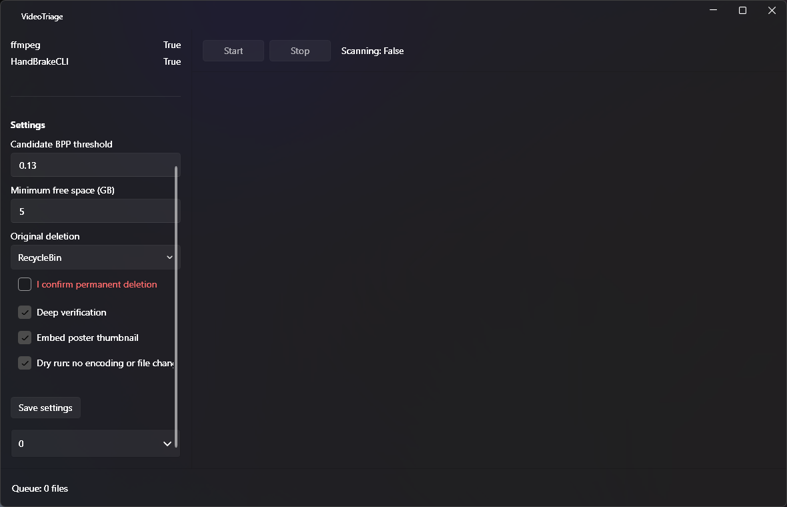
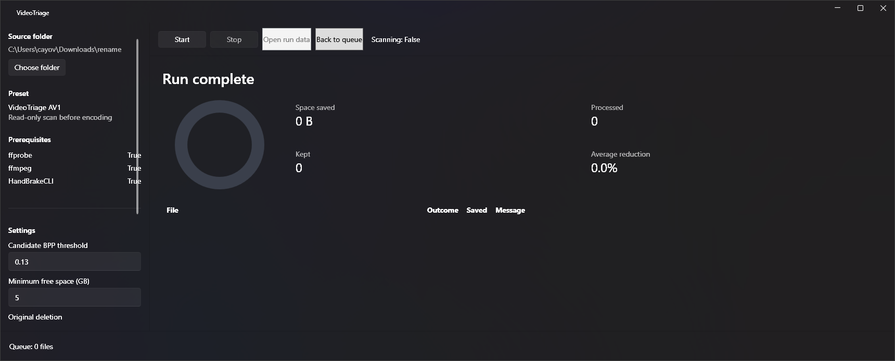

# VideoTriage

[](https://github.com/yovanmc/VideoTriage/actions/workflows/ci.yml)

VideoTriage is a Windows WPF application for finding video files that are worth recompressing,
encoding them to AV1, and keeping a replacement only when it is smaller and passes defensive
verification.

It grew from a PowerShell workflow calibrated on more than 1,700 real files. The product lesson was
simple: compression is not successful until the output is proven usable and the replacement order
protects the original.



## Safety First

- Dry-run stops after discovery, ffprobe metadata collection, and classification.
- Encoded candidates must pass metadata parity checks and optional full ffmpeg decode.
- Poster-bearing candidates are re-verified.
- The candidate must be non-empty and smaller than the original.
- Recycle Bin is the default deletion mode.
- Pause, cancellation, tool failure, verification failure, low disk space, and pre-removal
  exceptions leave the original untouched.
- A failed final rename preserves the verified replacement as `.videotriage.partial.*.mp4`.

Read the full [safety model](docs/safety.md).

## How It Fits Together

VideoTriage keeps WPF presentation in `VideoTriage.App` and the probing, classification, encoding,
verification, replacement, and state policy in `VideoTriage.Core`. A non-destructive CLI harness
also consumes Core. A separate Windows Application Packaging Project produces the x64 MSIX.

See [Architecture](docs/architecture.md) for diagrams and ownership boundaries.

## Requirements

- Windows 10 version 1809 or newer, x64
- ffmpeg and ffprobe on `PATH`
- HandBrakeCLI on `PATH`
- A supported NVIDIA GPU and driver for the shipped NVEnc AV1 preset

```powershell
winget install --exact --id Gyan.FFmpeg
winget install --exact --id HandBrake.HandBrake.CLI
```

The MSIX is self-contained; users do not need to install the .NET desktop runtime separately.

## Install

Download the `VideoTriage-win-x64-msix` artifact from a successful CI run and follow
[Install VideoTriage](docs/installation.md). CI artifacts are test-signed and include the public
development certificate required for installation.

## Start With Dry Run

1. Install and verify the external tools.
2. Open VideoTriage and select a folder containing disposable test media.
3. Enable **Dry run**.
4. Review candidate classifications.
5. Disable dry-run only after reviewing settings and the [safety model](docs/safety.md).



## Build And Test

```powershell
dotnet restore src/VideoTriage.App/VideoTriage.App.csproj
dotnet restore src/VideoTriage.Cli/VideoTriage.Cli.csproj
dotnet restore tests/VideoTriage.Core.Tests/VideoTriage.Core.Tests.csproj
dotnet restore tests/VideoTriage.App.Tests/VideoTriage.App.Tests.csproj

dotnet build src/VideoTriage.App/VideoTriage.App.csproj -c Release --no-restore
dotnet build src/VideoTriage.Cli/VideoTriage.Cli.csproj -c Release --no-restore
dotnet test tests/VideoTriage.Core.Tests/VideoTriage.Core.Tests.csproj -c Release
dotnet test tests/VideoTriage.App.Tests/VideoTriage.App.Tests.csproj -c Release
```

Core and App tests use fakes and isolated temporary directories. They do not encode, replace,
recycle, or delete user videos.

## Documentation

- [Installation and partial recovery](docs/installation.md)
- [Architecture](docs/architecture.md)
- [Safety model](docs/safety.md)
- [Release checklist](docs/release-checklist.md)
- [Prototype provenance](prototype/README.md)

## Release Status

The repository builds a test-signed self-contained `win-x64` MSIX in CI. Tagging, pushing, GitHub
release creation, Store submission, and production signing remain explicit maintainer-approved
actions.
