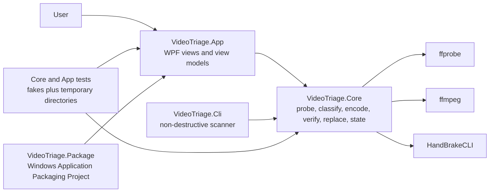
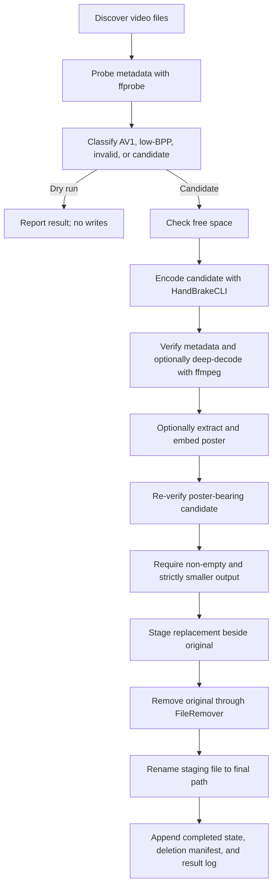

# Architecture

VideoTriage separates WPF presentation, video-triage policy, external process execution, and
Windows packaging. `VideoTriage.Core` has no WPF reference. `VideoTriage.App` composes the real
services through `Microsoft.Extensions.Hosting` and disables Start when required external tools
are unavailable.

## Project Boundaries

`VideoTriage.Package` produces a self-contained `win-x64` MSIX. `ffmpeg`, `ffprobe`, and
`HandBrakeCLI` remain external prerequisites and are not included in the package.

## Processing Pipeline

Only `SafeReplacer` may request original removal. Only `FileRemover` may invoke permanent-delete
or Recycle Bin APIs for an original; other deletion calls are limited to temporary working files.
Poster embedding creates a new candidate, reuses the output verifier, and cannot bypass
verification.

## Data And Diagnostics

| Data | Location | Format |
|---|---|---|
| Settings | `%LocalAppData%\VideoTriage\settings.json` | Indented JSON |
| Completed-file state | `<scanned folder>\_videotriage_data\completed.jsonl` | JSON Lines |
| Per-file result records | `<scanned folder>\_videotriage_data\results.jsonl` | JSON Lines |
| Original-removal manifest | `<scanned folder>\_videotriage_data\deletions.csv` | Quoted CSV with a header |
| Diagnostic logs | `%LocalAppData%\VideoTriage\Logs\videotriage-YYYYMMDD.log` | Daily rolling text logs |

The data directory name defaults to `_videotriage_data` and is configurable through
`TriageOptions`. Completed-file matching uses normalized full path, source length, and last-write
timestamp; a changed source is processed again. Dry run creates none of these per-folder records.

## Control Flow

- **Pause** sets a cooperative pause token. The current pipeline observes it before beginning each
  discovered file; an external process already in progress continues until it completes or Stop
  cancels it.
- **Resume** releases the pause token and returns the UI to the running state.
- **Stop** cancels the run token. `ProcessRunner` terminates an active external process tree, and
  pipeline cleanup removes temporary encode artifacts. A replacement already committed before
  cancellation remains completed.
- **Dry run** performs discovery, probe, and classification, reports terminal outcomes, and does
  not create state directories, encode media, or replace files.
- **Missing prerequisites** leave the real pipeline unavailable and disable Start; the app does not
  substitute a fake or no-op pipeline.

## Packaging And CI

The WPF application uses a separate Windows Application Packaging Project. Its publish profile
targets a self-contained `win-x64` deployment, and the packaging project emits one x64 MSIX rather
than a bundle.

CI restores and builds the App, CLI, and test projects, then runs the Core and App test suites. A
dependent packaging job creates a disposable development certificate and builds the test-signed
x64 MSIX only after those tests pass. It uploads the MSIX, public development certificate, and
installation guide; it does not tag, push, or publish a release.
