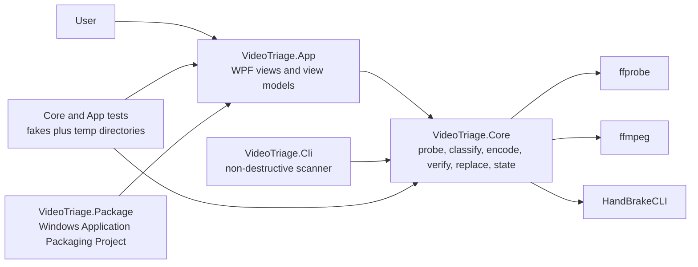
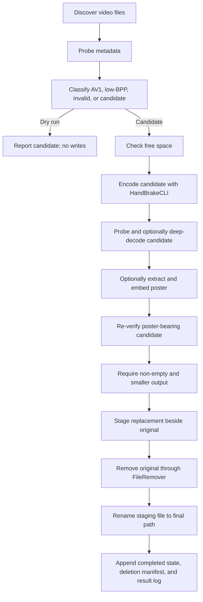

# README Screenshots Architecture CI And Release Polish Implementation Plan

> **For agentic workers:** REQUIRED SUB-SKILL: Use superpowers:subagent-driven-development (recommended) or superpowers:executing-plans to implement this plan task-by-task. Steps use checkbox (`- [ ]`) syntax for tracking.

**Goal:** Finish VideoTriage as an accurate, recruiter-facing portfolio repository with current app screenshots, architecture and safety documentation, a release checklist, and a README that links to the tested MSIX installation path without claiming unimplemented behavior.

**Architecture:** Documentation is derived from the integrated application and the architecture contract. Screenshots are captured from the actual Release WPF executable with synthetic disposable media; no HTML mockup or invented UI is used. Prototype provenance is documented without reconstructing or inventing unavailable PowerShell source.

**Tech Stack:** Markdown, Mermaid, PowerShell, WPF, ffmpeg synthetic media, GitHub Actions status badges.

---

## Authoritative References

- `docs/superpowers/plans/2026-06-07-architecture-contract.md`
- `docs/installation.md` from the packaging plan
- The integrated `src/VideoTriage.App` UI and `src/VideoTriage.Core` behavior
- The successful `VideoTriage-win-x64-msix` CI artifact

## Scope Check

This plan owns documentation, current screenshots, a reusable window-capture helper, and release
readiness checks. It does not modify application behavior, reconstruct a private prototype, create
sample prototype source, tag a release, push a branch, publish a GitHub release, or upload to the
Microsoft Store.

The README may retain the existing, repository-established statement that the workflow was
calibrated on more than 1,700 files. Do not include the previously proposed `40 GB / 33% savings`
claim because no source artifact in the workspace verifies it. Do not describe a specific data-loss
incident as fact; describe verify-before-destroy as the safety lesson that motivated the product.

## File Structure

```text
README.md
build/
  Capture-Window.ps1
docs/
  architecture.md
  assets/
    main-window.png
    summary.png
  release-checklist.md
  safety.md
prototype/
  README.md
```

### Task 1: Document The Implemented Architecture

**Files:**
- Create: `docs/architecture.md`

- [ ] **Step 1: Create the architecture document**

Create `docs/architecture.md`:

````markdown
# Architecture

VideoTriage separates WPF presentation, video-triage policy, external process execution, and
Windows packaging. The Core project has no WPF reference. The App composes the real services through
Microsoft.Extensions.Hosting and disables Start when required external tools are unavailable.

## Project Boundaries



`VideoTriage.Package` produces a self-contained `win-x64` MSIX. ffmpeg, ffprobe, and HandBrakeCLI
remain external prerequisites and are not included in the package.

## Processing Pipeline



Only `SafeReplacer` may request original removal, and only `FileRemover` may call permanent-delete
or Recycle Bin APIs. Poster embedding creates a new candidate and cannot bypass output verification.

## Data And Diagnostics

| Data | Location | Format |
|---|---|---|
| Settings | `%AppData%\VideoTriage\settings.json` | JSON |
| Completed state and run records | `%LocalAppData%\VideoTriage\Data` | JSON Lines and CSV |
| Diagnostic logs | `%LocalAppData%\VideoTriage\Logs` | Rolling text logs |

Completed-file matching uses normalized full path, source length, and last-write timestamp. A changed
source is processed again.

## Control Flow

- **Pause** is observed between phases and during encode progress.
- **Resume** releases the pause token and continues the current run.
- **Stop** cancels the active process tree, cleans temporary artifacts, and leaves the original
  untouched.
- **Dry run** stops after discovery, probe, and classification.
- Missing prerequisites disable Start; the app never substitutes a fake or no-op pipeline.

## Packaging And CI

The non-WinUI WPF app uses a separate Windows Application Packaging Project, following Microsoft
Learn guidance. CI restores, builds, runs Core and App tests, then creates a test-signed x64 MSIX
only after tests pass. CI uploads the MSIX and its public development certificate; it does not tag,
push, or publish a release.
````

- [ ] **Step 2: Validate Mermaid blocks and required boundaries**

Run:

```powershell
$text = Get-Content -Raw docs/architecture.md
$required = @(
    'VideoTriage.App',
    'VideoTriage.Core',
    'VideoTriage.Package',
    'Only `SafeReplacer` may request original removal',
    'Dry run',
    '%LocalAppData%\VideoTriage\Logs',
    'Windows Application Packaging Project'
)
$missing = $required | Where-Object { -not $text.Contains($_) }
if ($missing) { throw "Architecture doc is missing: $($missing -join ', ')" }
$fences = ([regex]::Matches($text, '```mermaid')).Count
if ($fences -ne 2) { throw "Expected two Mermaid diagrams, found $fences." }
'Architecture documentation is complete.'
```

Expected:

```text
Architecture documentation is complete.
```

- [ ] **Step 3: Commit**

```powershell
git add docs/architecture.md
git commit -m "docs: explain application and pipeline architecture"
```

### Task 2: Document The Safety Contract And Recovery

**Files:**
- Create: `docs/safety.md`

- [ ] **Step 1: Create the safety document**

Create `docs/safety.md`:

````markdown
# Safety Model

VideoTriage follows one invariant:

> An original video may be removed only after a smaller replacement has passed every enabled
> verification check and the replacement has been confirmed on disk.

## Before Original Removal

For each candidate, VideoTriage:

1. Encodes to a temporary candidate path.
2. Confirms the candidate exists and is non-empty.
3. Probes duration, resolution, video, and audio metadata.
4. Runs a full ffmpeg decode when deep verification is enabled.
5. Repeats verification after optional poster embedding.
6. Confirms the final candidate is smaller than the original.
7. Moves the candidate to a distinct same-directory staging path (never equal to the encode path).
8. Confirms staging exists with the expected length.

Only then may `SafeReplacer` ask `FileRemover` to remove the original.

## Failure Guarantees

Pause, cancellation, missing tools, low disk space, encode failure, verification failure, poster
failure, a candidate that grew, or an exception before removal leaves the original untouched. Stop
kills the active external process tree and removes temporary work where possible.

If removal succeeds but the final rename fails, VideoTriage preserves the verified replacement as:

```text
<name>.videotriage.partial.<process-id>.mp4
```

That outcome is reported as `ReplacePartial`; it is not silently treated as a normal replacement.
Follow [Install VideoTriage](installation.md#recover-a-partial-replacement) to verify and rename the
partial file.

## Deletion Modes

- **Recycle Bin** is the default.
- **Permanent** deletion requires explicit user selection and a visible warning.
- Only `FileRemover` calls Windows deletion APIs.
- Tests use fakes and isolated temporary directories; they never encode, recycle, replace, or delete
  user videos.

## Dry Run

Dry-run performs discovery, ffprobe metadata collection, and classification only. It does not call
HandBrakeCLI, deep-decode through ffmpeg, embed posters, replace files, remove originals, or persist
completed-file state.

Use dry-run on every new folder or settings change before allowing replacement.

## State And Audit Files

VideoTriage stores completed-file state, deletion manifests, and result records under
`%LocalAppData%\VideoTriage\Data`. A deletion-manifest record is appended only after
`ReplaceResult.OriginalRemoved` is true. Diagnostic logs are under
`%LocalAppData%\VideoTriage\Logs`.

These records help explain what happened, but bookkeeping never controls or weakens replacement
ordering.
````

- [ ] **Step 2: Verify every non-negotiable guarantee is represented**

Run:

```powershell
$text = Get-Content -Raw docs/safety.md
$required = @(
    'smaller replacement',
    'passed every enabled verification check',
    'Recycle Bin',
    'Permanent',
    'SafeReplacer',
    'FileRemover',
    'Dry-run',
    '.videotriage.partial.',
    'OriginalRemoved',
    'original untouched'
)
$missing = $required | Where-Object { -not $text.Contains($_) }
if ($missing) { throw "Safety doc is missing: $($missing -join ', ')" }
'Safety documentation covers the architecture contract.'
```

Expected:

```text
Safety documentation covers the architecture contract.
```

- [ ] **Step 3: Commit**

```powershell
git add docs/safety.md
git commit -m "docs: document verify-before-destroy safety model"
```

### Task 3: Add A Reproducible WPF Window Capture Helper

**Files:**
- Create: `build/Capture-Window.ps1`

- [ ] **Step 1: Create the capture script**

Create `build/Capture-Window.ps1`:

```powershell
[CmdletBinding()]
param(
    [Parameter(Mandatory)]
    [string] $ProcessName,

    [Parameter(Mandatory)]
    [string] $OutputPath
)

$ErrorActionPreference = 'Stop'
Add-Type -AssemblyName System.Drawing

Add-Type @'
using System;
using System.Runtime.InteropServices;

public static class VideoTriageWindowCapture
{
    [StructLayout(LayoutKind.Sequential)]
    public struct Rect
    {
        public int Left;
        public int Top;
        public int Right;
        public int Bottom;
    }

    [DllImport("user32.dll")]
    public static extern bool GetWindowRect(IntPtr hWnd, out Rect rect);

    [DllImport("user32.dll")]
    public static extern bool SetForegroundWindow(IntPtr hWnd);
}
'@

$process = Get-Process -Name $ProcessName |
    Where-Object MainWindowHandle -ne 0 |
    Select-Object -First 1

if (-not $process) {
    throw "No visible window was found for process '$ProcessName'."
}

[VideoTriageWindowCapture]::SetForegroundWindow($process.MainWindowHandle) | Out-Null
Start-Sleep -Milliseconds 500

$rect = [VideoTriageWindowCapture+Rect]::new()
if (-not [VideoTriageWindowCapture]::GetWindowRect($process.MainWindowHandle, [ref]$rect)) {
    throw 'GetWindowRect failed.'
}

$width = $rect.Right - $rect.Left
$height = $rect.Bottom - $rect.Top
if ($width -lt 800 -or $height -lt 500) {
    throw "Window is too small for release capture: ${width}x${height}."
}

$bitmap = [System.Drawing.Bitmap]::new($width, $height)
$graphics = [System.Drawing.Graphics]::FromImage($bitmap)
try {
    $graphics.CopyFromScreen(
        $rect.Left,
        $rect.Top,
        0,
        0,
        [System.Drawing.Size]::new($width, $height))

    $absoluteOutput = [System.IO.Path]::GetFullPath($OutputPath)
    New-Item -ItemType Directory -Force -Path (Split-Path $absoluteOutput -Parent) |
        Out-Null
    $bitmap.Save($absoluteOutput, [System.Drawing.Imaging.ImageFormat]::Png)
    Write-Output "Captured $absoluteOutput (${width}x${height})"
}
finally {
    $graphics.Dispose()
    $bitmap.Dispose()
}
```

- [ ] **Step 2: Verify the script parses**

Run:

```powershell
$errors = $null
[System.Management.Automation.Language.Parser]::ParseFile(
    (Resolve-Path 'build/Capture-Window.ps1'),
    [ref]$null,
    [ref]$errors) | Out-Null
if ($errors.Count -gt 0) { throw ($errors | Out-String) }
'Capture script parses successfully.'
```

Expected:

```text
Capture script parses successfully.
```

- [ ] **Step 3: Commit**

```powershell
git add build/Capture-Window.ps1
git commit -m "build(docs): add WPF screenshot capture helper"
```

### Task 4: Capture Current Main And Summary Screens

**Files:**
- Create: `docs/assets/main-window.png`
- Create: `docs/assets/summary.png`
- Runtime-only: `artifacts/screenshot-fixtures/sample.mp4`

- [ ] **Step 1: Verify external tools and build the Release app**

Run:

```powershell
ffmpeg -version
ffprobe -version
HandBrakeCLI --version
dotnet build src/VideoTriage.App/VideoTriage.App.csproj -c Release
```

Expected: each tool prints version information; the app build exits `0` with `0 Error(s)`.

If a tool command is missing, execute the exact prerequisite commands from `docs/installation.md`,
open a new PowerShell window, and rerun this step. Do not capture a release screenshot with missing
prerequisites.

- [ ] **Step 2: Generate disposable synthetic media**

Run:

```powershell
New-Item -ItemType Directory -Force artifacts/screenshot-fixtures | Out-Null
ffmpeg -y `
  -f lavfi -i "testsrc2=size=1280x720:rate=30" `
  -f lavfi -i "sine=frequency=1000:sample_rate=48000" `
  -t 8 `
  -c:v libx264 -pix_fmt yuv420p `
  -c:a aac `
  artifacts/screenshot-fixtures/sample.mp4

ffprobe -v error `
  -show_entries format=duration `
  -of default=noprint_wrappers=1:nokey=1 `
  artifacts/screenshot-fixtures/sample.mp4
```

Expected: ffmpeg exits `0`; `sample.mp4` exists and is non-empty; ffprobe prints a duration close to
`8.000000`.

- [ ] **Step 3: Launch the real Release app**

Run:

```powershell
$app = Resolve-Path `
  'src/VideoTriage.App/bin/Release/net10.0-windows/VideoTriage.App.exe'
Start-Process $app
```

Expected: the VideoTriage WPF window opens with all three prerequisites available.

- [ ] **Step 4: Prepare and capture the main queue**

In the running app:

1. Select `artifacts/screenshot-fixtures`.
2. Turn on **Dry run**.
3. Start the run.
4. Wait until `sample.mp4` appears in the queue with its terminal dry-run classification.
5. Resize the window to at least `1200x760`.
6. Ensure no tooltip, menu, file picker, notification, or unrelated application overlaps it.

Then run:

```powershell
pwsh -NoProfile -File build/Capture-Window.ps1 `
  -ProcessName VideoTriage.App `
  -OutputPath docs/assets/main-window.png
```

Expected: `docs/assets/main-window.png` is created from the actual WPF window and the command reports
dimensions of at least `800x500`.

- [ ] **Step 5: Prepare and capture the post-run summary**

In the running app, open the immutable post-run summary for the completed dry-run. Keep the app
window at the same dimensions, then run:

```powershell
pwsh -NoProfile -File build/Capture-Window.ps1 `
  -ProcessName VideoTriage.App `
  -OutputPath docs/assets/summary.png
```

Expected: `docs/assets/summary.png` is created and visibly contains the actual summary view. Do not
use the HTML mockup, a design image, a test rendering, or an edited composite.

- [ ] **Step 6: Inspect dimensions and file sizes**

Run:

```powershell
Add-Type -AssemblyName System.Drawing
foreach ($path in @('docs/assets/main-window.png', 'docs/assets/summary.png')) {
    $image = [System.Drawing.Image]::FromFile((Resolve-Path $path))
    try {
        if ($image.Width -lt 800 -or $image.Height -lt 500) {
            throw "$path is too small: $($image.Width)x$($image.Height)"
        }
        if ((Get-Item $path).Length -lt 50000) {
            throw "$path is unexpectedly small."
        }
        "$path $($image.Width)x$($image.Height)"
    }
    finally {
        $image.Dispose()
    }
}
```

Expected: two lines with dimensions at least `800x500`; no exception.

- [ ] **Step 7: Visually self-review both PNGs**

Open both files and check:

```text
[ ] Image comes from the real Release WPF app.
[ ] Text is legible at repository preview size.
[ ] No personal folder outside artifacts/screenshot-fixtures is visible.
[ ] No unrelated desktop content is visible.
[ ] Main screenshot shows selected synthetic folder, dry-run state, and queue result.
[ ] Summary screenshot shows the actual post-run summary.
[ ] No clipped controls, open menus, tooltips, or transient error banners.
```

Expected: every item is true. Recapture immediately if any item fails.

- [ ] **Step 8: Commit**

```powershell
git add docs/assets/main-window.png docs/assets/summary.png
git commit -m "docs: add current application screenshots"
```

### Task 5: Rewrite The README From Verified Behavior

**Files:**
- Modify: `README.md`

- [ ] **Step 1: Replace the README**

Replace `README.md` with:

````markdown
# VideoTriage

[](https://github.com/yovanmc/VideoTriage/actions/workflows/ci.yml)

VideoTriage is a Windows WPF application for finding video files that are worth recompressing,
encoding them to AV1, and keeping a replacement only when it is smaller and passes defensive
verification.

It grew from a PowerShell workflow calibrated on more than 1,700 real files. The product lesson was
simple: compression is not successful until the output is proven usable and the replacement order
protects the original.


## Safety First

- Dry-run stops after discovery, ffprobe metadata collection, and classification.
- Encoded candidates must pass metadata parity checks and optional full ffmpeg decode.
- Poster-bearing candidates are re-verified.
- The candidate must be non-empty and smaller than the original.
- Recycle Bin is the default deletion mode.
- Pause, cancellation, tool failure, verification failure, low disk space, and pre-removal
  exceptions leave the original untouched.
- A failed final rename preserves the verified replacement as `.videotriage.partial.*.mp4`.

Read the full [safety model](docs/safety.md).

## How It Fits Together

VideoTriage keeps WPF presentation in `VideoTriage.App` and the probing, classification, encoding,
verification, replacement, and state policy in `VideoTriage.Core`. A non-destructive CLI harness
also consumes Core. A separate Windows Application Packaging Project produces the x64 MSIX.

See [Architecture](docs/architecture.md) for diagrams and ownership boundaries.

## Requirements

- Windows 10 version 1809 or newer, x64
- ffmpeg and ffprobe on `PATH`
- HandBrakeCLI on `PATH`
- A supported NVIDIA GPU and driver for the shipped NVEnc AV1 preset

```powershell
winget install --exact --id Gyan.FFmpeg
winget install --exact --id HandBrake.HandBrake.CLI
```

The MSIX is self-contained; users do not need to install the .NET desktop runtime separately.

## Install

Download the `VideoTriage-win-x64-msix` artifact from a successful CI run and follow
[Install VideoTriage](docs/installation.md). CI artifacts are test-signed and include the public
development certificate required for installation.

## Start With Dry Run

1. Install and verify the external tools.
2. Open VideoTriage and select a folder containing disposable test media.
3. Enable **Dry run**.
4. Review candidate classifications.
5. Disable dry-run only after reviewing settings and the [safety model](docs/safety.md).


## Build And Test

```powershell
dotnet restore src/VideoTriage.App/VideoTriage.App.csproj
dotnet restore src/VideoTriage.Cli/VideoTriage.Cli.csproj
dotnet restore tests/VideoTriage.Core.Tests/VideoTriage.Core.Tests.csproj
dotnet restore tests/VideoTriage.App.Tests/VideoTriage.App.Tests.csproj

dotnet build src/VideoTriage.App/VideoTriage.App.csproj -c Release --no-restore
dotnet build src/VideoTriage.Cli/VideoTriage.Cli.csproj -c Release --no-restore
dotnet test tests/VideoTriage.Core.Tests/VideoTriage.Core.Tests.csproj -c Release
dotnet test tests/VideoTriage.App.Tests/VideoTriage.App.Tests.csproj -c Release
```

Core and App tests use fakes and isolated temporary directories. They do not encode, replace,
recycle, or delete user videos.

## Documentation

- [Installation and partial recovery](docs/installation.md)
- [Architecture](docs/architecture.md)
- [Safety model](docs/safety.md)
- [Release checklist](docs/release-checklist.md)
- [Prototype provenance](prototype/README.md)

## Release Status

The repository builds a test-signed self-contained `win-x64` MSIX in CI. Tagging, pushing, GitHub
release creation, Store submission, and production signing remain explicit maintainer-approved
actions.
````

- [ ] **Step 2: Verify README claims and local links**

Run:

```powershell
$readme = Get-Content -Raw README.md
$required = @(
    'more than 1,700 real files',
    'verify',
    'Recycle Bin',
    'docs/assets/main-window.png',
    'docs/assets/summary.png',
    'docs/installation.md',
    'docs/architecture.md',
    'docs/safety.md',
    'test-signed self-contained `win-x64` MSIX'
)
$forbidden = @(
    '40 GB',
    '33%',
    'original private prototype source',
    'automatic release'
)
foreach ($value in $required) {
    if (-not $readme.Contains($value)) { throw "README is missing $value" }
}
foreach ($value in $forbidden) {
    if ($readme.Contains($value)) { throw "README contains unsupported claim: $value" }
}
foreach ($path in @(
    'docs/assets/main-window.png',
    'docs/assets/summary.png',
    'docs/installation.md',
    'docs/architecture.md',
    'docs/safety.md'
)) {
    if (-not (Test-Path $path)) { throw "README target does not exist: $path" }
}
'README claims and local links are valid.'
```

Expected:

```text
README claims and local links are valid.
```

- [ ] **Step 3: Commit**

```powershell
git add README.md
git commit -m "docs: rewrite README around verified product behavior"
```

### Task 6: Record Prototype Provenance Without Inventing Source

**Files:**
- Create: `prototype/README.md`

- [ ] **Step 1: Create the provenance document**

Create `prototype/README.md`:

```markdown
# Prototype Provenance

VideoTriage was derived from a PowerShell batch workflow calibrated on more than 1,700 files.

The original prototype source artifact was not present in the planning workspace and is not included
in this repository. This directory intentionally contains provenance documentation only. No
replacement PowerShell prototype, pseudo-source, reconstructed script, benchmark table, or savings
claim has been invented.

The maintained implementation is the C# solution under `src/`, governed by the documented
verify-before-destroy architecture and its automated tests.
```

- [ ] **Step 2: Prove no prototype source was added**

Run:

```powershell
$files = @(Get-ChildItem prototype -Recurse -File)
if ($files.Count -ne 1 -or $files[0].Name -ne 'README.md') {
    throw "prototype/ must contain only README.md; found: $($files.FullName -join ', ')"
}
'Prototype provenance contains documentation only.'
```

Expected:

```text
Prototype provenance contains documentation only.
```

- [ ] **Step 3: Commit**

```powershell
git add prototype/README.md
git commit -m "docs: record prototype provenance without reconstruction"
```

### Task 7: Add The Exact Release Checklist

**Files:**
- Create: `docs/release-checklist.md`

- [ ] **Step 1: Create the checklist**

Create `docs/release-checklist.md`:

````markdown
# Release Checklist

This checklist prepares a release; it does not authorize tagging, pushing, production signing,
GitHub release creation, or Store submission.

## 1. Repository State

- [ ] Work from updated `main` after packaging is integrated.
- [ ] `git status --short` is empty before release verification.
- [ ] `git diff --check` prints no output.
- [ ] README, installation, architecture, safety, screenshots, and prototype provenance describe the
      integrated behavior.

## 2. Restore, Build, And Test

Run:

```powershell
dotnet restore src/VideoTriage.App/VideoTriage.App.csproj
dotnet restore src/VideoTriage.Cli/VideoTriage.Cli.csproj
dotnet restore tests/VideoTriage.Core.Tests/VideoTriage.Core.Tests.csproj
dotnet restore tests/VideoTriage.App.Tests/VideoTriage.App.Tests.csproj

dotnet build src/VideoTriage.App/VideoTriage.App.csproj -c Release --no-restore
dotnet build src/VideoTriage.Cli/VideoTriage.Cli.csproj -c Release --no-restore
dotnet test tests/VideoTriage.Core.Tests/VideoTriage.Core.Tests.csproj -c Release
dotnet test tests/VideoTriage.App.Tests/VideoTriage.App.Tests.csproj -c Release
```

- [ ] All commands exit `0`.
- [ ] Both test projects report `Failed: 0`.

## 3. Package Artifact

- [ ] The latest `main` CI run is green.
- [ ] Download `VideoTriage-win-x64-msix`.
- [ ] The artifact contains exactly one `.msix`, `VideoTriage.Development.cer`, and
      `installation.md`.
- [ ] The artifact contains no `.pfx`.
- [ ] The package identity is `YovanMc.VideoTriage`, version `1.0.0.0`, architecture `x64`.
- [ ] The package contains `VideoTriage.App.exe` and `coreclr.dll`.
- [ ] The package contains no `ffmpeg.exe`, `ffprobe.exe`, or `HandBrakeCLI.exe`.

## 4. Disposable Installation Check

Run on a Windows x64 test account:

```powershell
Import-Certificate `
  -FilePath .\VideoTriage.Development.cer `
  -CertStoreLocation Cert:\CurrentUser\TrustedPeople
Add-AppxPackage .\VideoTriage.Package_*.msix
Get-AppxPackage YovanMc.VideoTriage |
  Select-Object Name, Version, Architecture, Status
```

- [ ] Package status is `Ok`.
- [ ] VideoTriage launches from the Start menu.
- [ ] Missing prerequisites disable Start and show install guidance.
- [ ] Uninstall succeeds through Settings or `Remove-AppxPackage`.

## 5. Manual Safety Check On Disposable Media

- [ ] Install ffmpeg, ffprobe, and HandBrakeCLI using `docs/installation.md`.
- [ ] Generate a synthetic video under `artifacts/release-smoke`; do not use personal media.
- [ ] Run dry-run and confirm no encode, replacement, deletion, or completed-state write occurs.
- [ ] Run one Recycle Bin replacement and confirm the replacement is smaller and playable.
- [ ] Confirm the original appears in the Recycle Bin.
- [ ] Cancel one active encode and confirm the original remains untouched.
- [ ] Confirm diagnostics are written under `%LocalAppData%\VideoTriage\Logs`.
- [ ] Confirm state records are written under `%LocalAppData%\VideoTriage\Data`.
- [ ] Confirm `.videotriage.partial.*` recovery instructions match the current implementation.

## 6. Documentation And Visual Review

- [ ] `docs/assets/main-window.png` shows the current Release app and dry-run queue.
- [ ] `docs/assets/summary.png` shows the current post-run summary.
- [ ] Screenshots contain no personal paths, unrelated windows, or transient UI.
- [ ] Mermaid diagrams render on GitHub.
- [ ] Every README local link resolves.
- [ ] README does not claim `40 GB`, `33%`, invented benchmark results, or unavailable prototype
      source.

## 7. Approval Gate

Stop and obtain explicit maintainer approval before any of these commands or actions:

```text
git tag v0.1.0
git push origin main
git push origin v0.1.0
gh release create ...
production certificate signing
Microsoft Store submission
```

Record the approved version, commit SHA, signer identity, artifact hash, and publication destination
in the release notes before publishing.
````

- [ ] **Step 2: Verify the approval boundary**

Run:

```powershell
$text = Get-Content -Raw docs/release-checklist.md
$required = @(
    'git tag v0.1.0',
    'git push origin main',
    'gh release create',
    'production certificate signing',
    'Microsoft Store submission',
    'explicit maintainer approval',
    'contains no `.pfx`',
    'Recycle Bin replacement',
    'Cancel one active encode'
)
$missing = $required | Where-Object { -not $text.Contains($_) }
if ($missing) { throw "Release checklist is missing: $($missing -join ', ')" }
'Release checklist includes verification and explicit publication gates.'
```

Expected:

```text
Release checklist includes verification and explicit publication gates.
```

- [ ] **Step 3: Commit**

```powershell
git add docs/release-checklist.md
git commit -m "docs: add gated release verification checklist"
```

### Task 8: Final Documentation Verification And Handoff

**Files:**
- Verify all files from Tasks 1-7.

- [ ] **Step 1: Run Release build and tests**

```powershell
dotnet restore src/VideoTriage.App/VideoTriage.App.csproj
dotnet restore src/VideoTriage.Cli/VideoTriage.Cli.csproj
dotnet restore tests/VideoTriage.Core.Tests/VideoTriage.Core.Tests.csproj
dotnet restore tests/VideoTriage.App.Tests/VideoTriage.App.Tests.csproj

dotnet build src/VideoTriage.App/VideoTriage.App.csproj -c Release --no-restore
dotnet build src/VideoTriage.Cli/VideoTriage.Cli.csproj -c Release --no-restore
dotnet test tests/VideoTriage.Core.Tests/VideoTriage.Core.Tests.csproj -c Release
dotnet test tests/VideoTriage.App.Tests/VideoTriage.App.Tests.csproj -c Release
```

Expected: all commands exit `0`; both test projects report `Failed: 0`.

- [ ] **Step 2: Validate documentation files and image targets**

Run:

```powershell
$requiredFiles = @(
    'README.md',
    'docs/architecture.md',
    'docs/safety.md',
    'docs/installation.md',
    'docs/release-checklist.md',
    'docs/assets/main-window.png',
    'docs/assets/summary.png',
    'prototype/README.md',
    'build/Capture-Window.ps1'
)
$missing = $requiredFiles | Where-Object { -not (Test-Path $_) }
if ($missing) { throw "Missing release file(s): $($missing -join ', ')" }

$prototypeFiles = @(Get-ChildItem prototype -Recurse -File)
if ($prototypeFiles.Count -ne 1 -or $prototypeFiles[0].Name -ne 'README.md') {
    throw 'Prototype directory contains invented source.'
}

'All release documentation and screenshot files exist.'
```

Expected:

```text
All release documentation and screenshot files exist.
```

- [ ] **Step 3: Scan for placeholders, unsupported claims, and publication automation**

Run:

```powershell
rg -n "TBD|TODO|implement later|coming soon|40 GB|33%|reconstructed prototype" `
  README.md docs/architecture.md docs/safety.md docs/release-checklist.md prototype/README.md

rg -n "gh release create|actions/create-release|git push|git tag" .github/workflows
```

Expected:

- The first `rg` prints nothing.
- The second `rg` prints nothing.
- Commands shown as prohibited examples inside `docs/release-checklist.md` are not scanned because
  documentation may name them only as approval-gated actions.

- [ ] **Step 4: Check formatting and changed-file scope**

Run:

```powershell
git diff --check
git status --short
git diff --name-only main...HEAD
```

Expected:

- `git diff --check` prints nothing.
- No generated fixture under `artifacts/` is tracked.
- Changed files are limited to:

```text
README.md
build/Capture-Window.ps1
docs/architecture.md
docs/assets/main-window.png
docs/assets/summary.png
docs/release-checklist.md
docs/safety.md
prototype/README.md
```

If packaging commits are intentionally part of the same branch, their already-reviewed files may
also appear; do not alter them in this plan.

- [ ] **Step 5: Complete the fresh-eyes self-review**

Check the integrated files:

```text
[ ] Every behavioral statement is visible in code, tests, package contents, or the architecture
    contract.
[ ] README leads with purpose and safety, not implementation chronology.
[ ] README links to installation, architecture, safety, release checklist, and provenance.
[ ] Screenshots are current real WPF captures and contain no private information.
[ ] Architecture diagrams show App, Core, CLI, tests, package project, and external tools.
[ ] Safety docs preserve verify-before-destroy, Recycle Bin default, cancellation, dry-run, manifest
    timing, and partial recovery.
[ ] Prototype directory contains only provenance documentation.
[ ] No unverified 40 GB / 33% claim appears.
[ ] No automatic tag, push, GitHub release, production signing, or Store submission exists.
```

Expected: every item is true. Correct documentation or recapture screenshots before continuing.

- [ ] **Step 6: Commit any final corrections**

```powershell
git add `
  README.md `
  build/Capture-Window.ps1 `
  docs/architecture.md `
  docs/assets/main-window.png `
  docs/assets/summary.png `
  docs/release-checklist.md `
  docs/safety.md `
  prototype/README.md
git commit -m "docs: finalize release presentation and handoff"
```

Expected: commit succeeds, or Git reports there is nothing to commit because all work was committed
task-by-task.

## Self-Review

- **Spec coverage:** Architecture, safety, installation link, real screenshots, README, prototype
  provenance, CI status, and release gates each have a dedicated task and verification command.
- **Placeholder scan:** All documentation content, screenshot paths, capture commands, claims, and
  approval boundaries are fixed. There is no request to wait for future user-provided prose or
  prototype source.
- **Accuracy:** The plan keeps the existing 1,700-file provenance, removes unsupported savings
  numbers, and describes only integrated behavior.
- **Safety and publication:** Release readiness is verified, while tagging, pushing, production
  signing, GitHub release creation, and Store publication remain explicit maintainer-approved
  actions.

## Execution Handoff

Execute on `feature/release-polish` after `feature/packaging-installation` is reviewed and integrated
into updated `main`. Do not pause for hidden visual assets or prototype source; generate the
synthetic media, capture the real app, and finish the documentation as written.

Return:

```text
Status: COMPLETE or NEEDS_CONTEXT
Branch: feature/release-polish
Verification: Release build/test results and documentation checks
Screenshots: dimensions and exact paths for main-window.png and summary.png
Changed files: exact git diff --name-only output
Key decisions: real WPF captures; 1,700-file provenance retained; unsupported savings omitted;
               prototype source not reconstructed; publication actions not performed
```

Use `NEEDS_CONTEXT` only if the integrated app cannot reach either the queue or summary view after
three documented attempts with the synthetic fixture, and include the exact failing command, UI
state, and log path. Missing private prototype source is not a blocker and must not cause
`NEEDS_CONTEXT`.
